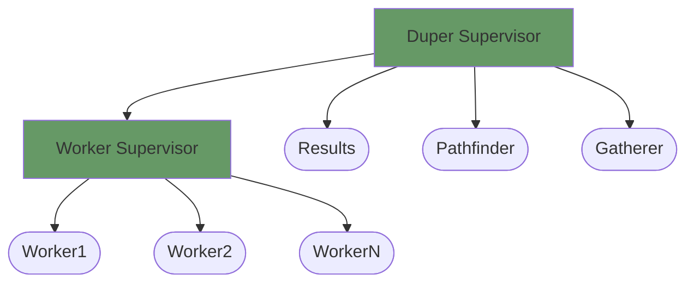
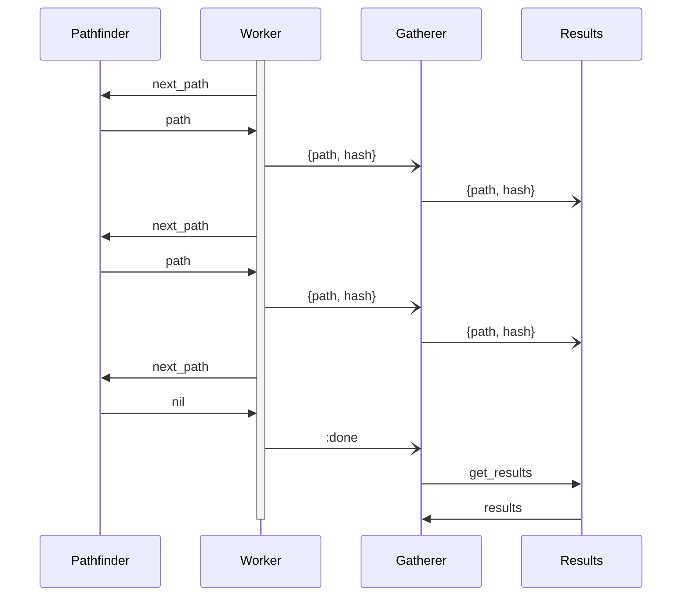

# Duper

Duplicate-file-finding application.

Based on Chapter 19 of <https://pragprog.com/titles/elixir16/programming-elixir-1-6/>.

## Initial supervision structure



## Sequence diagram



## Runtime metrics

```sh
➜ time mix run --no-halt > dups       
mix run --no-halt > dups  6.08s user 1.24s system 81% cpu 8.927 total # 1 worker
➜ time mix run --no-halt > dups
mix run --no-halt > dups  5.86s user 1.27s system 176% cpu 4.041 total # 2 workers
➜ time mix run --no-halt > dups       
mix run --no-halt > dups  6.05s user 1.41s system 207% cpu 3.598 total # 3 workers
➜ time mix run --no-halt > dups       
mix run --no-halt > dups  5.83s user 1.36s system 217% cpu 3.304 total # 4 workers
➜ time mix run --no-halt > dups       
mix run --no-halt > dups  6.30s user 1.70s system 246% cpu 3.243 total # 8 workers
➜ time mix run --no-halt > dups       
mix run --no-halt > dups  6.14s user 1.73s system 247% cpu 3.173 total # 80 workers
```