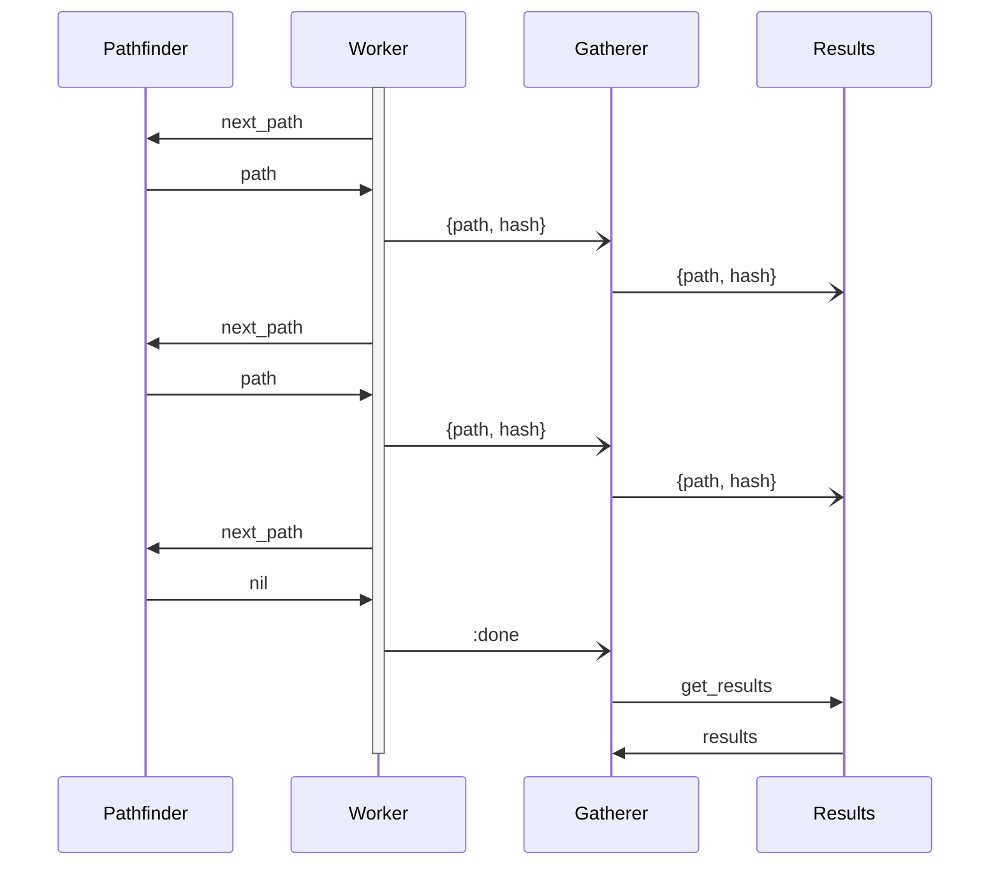

# Duper

Duplicate-file-finding application.

Based on Chapter 19 of <https://pragprog.com/titles/elixir16/programming-elixir-1-6/>.

## Initial supervision structure

```mermaid
flowchart TD
    dsup[Duper Supervisor]
    wsup[Worker Supervisor]
    res([Results])
    path([Pathfinder])
    gath([Gatherer])
    w1([Worker1])
    w2([Worker2])
    wn([WorkerN])
    dsup --> res
    dsup --> path
    dsup --> wsup
    dsup --> gath
    wsup --> w1
    wsup --> w2
    wsup --> wn
    classDef sup fill:#696;
    class dsup,wsup sup;
```

## Sequence diagram

```mermaid
sequenceDiagram
participant P as Pathfinder
participant W as Worker
participant G as Gatherer
participant R as Results
activate W
W ->> P: next_path
P ->> W: path
W -) G: {path, hash}
G -) R: {path, hash}
W ->> P: next_path
P ->> W: path
W -) G: {path, hash}
G -) R: {path, hash}
W ->> P: next_path
P ->> W: nil
W -) G: :done
G ->> R: get_results
R ->> G: results

deactivate W
```